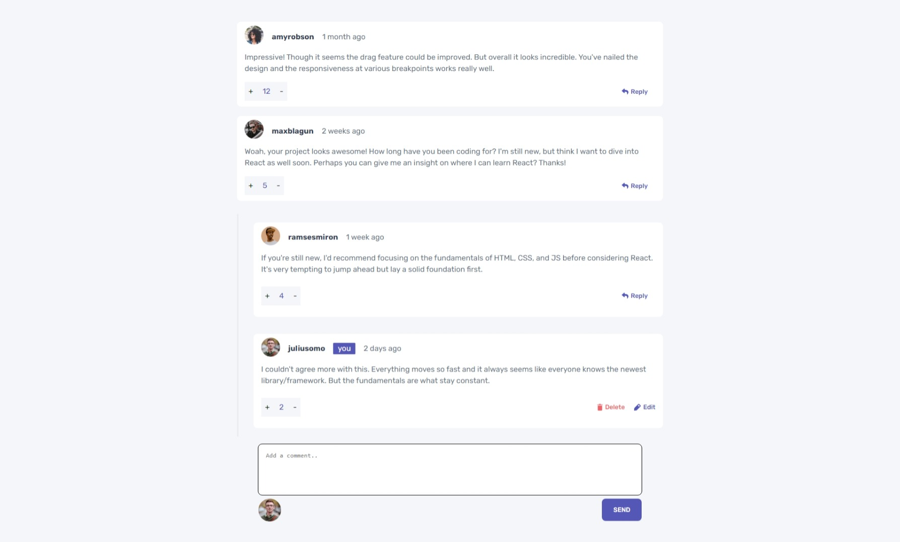

# Frontend Mentor - Interactive comments section solution

This is a solution to the [Interactive comments section challenge on Frontend Mentor](https://www.frontendmentor.io/challenges/interactive-comments-section-iG1RugEG9). Frontend Mentor challenges help you improve your coding skills by building realistic projects. 

## Table of contents

- [Overview](#overview)
  - [The challenge](#the-challenge)
  - [Screenshot](#screenshot)
  - [Links](#links)
- [My process](#my-process)
  - [Built with](#built-with)
  - [What I learned](#what-i-learned)
  - [Continued development](#continued-development)
- [Author](#author)
- [Acknowledgments](#acknowledgments)

## Overview

### The challenge

This is a challenge to create interactive comments section from frontend mentor. 
It is a intermediate level challenge.

### Screenshot

### Links

- Solution URL: [My Solution](https://github.com/AkashKrish1609/interactive-comments)
- Live Site URL: [Live Site](https://akashkrish1609.github.io/interactive-comments/)

## My process

### Built with

- HTML5
- CSS custom properties
- Flexbox
- CSS Grid
- Pure Javascript

### What I learned

Uff!!..Amazing experience in completinng this project for many reasons...The things I learned in Javascript from doing this project were a lot..Some of it are....
- use of backtick in js..This was the first time I used it and I love it already..
- A lot of properties like nextElementSibling, nextSibling, target.closest(), preventDefault(), stopImmediatePropagation() and many more..
- I came to know about HTMLcollection and how to use Array.from() to change it into array and use filter() property to filter the array and get the required element with the class name
- I learnt about Focus() and stuff 

### Continued development

I need to find out about how to place the cursor at the last when in focus..and whole lot more improvements possible

## Author

- Frontend Mentor - [@AkashKrish1609](https://www.frontendmentor.io/profile/AkashKrish1609)
- Twitter - [@SANKAR_1609](https://twitter.com/SANKAR_1609)

## Acknowledgments

To be honest 95-99% I used only the design as a reference that is why this project is so special for me.. I worked day in and out for a week seeking help from a lot and from stackOverflow ofcourse.... I have been patient and hard-working in this project and I could do this project even better.... Trust the Process...

